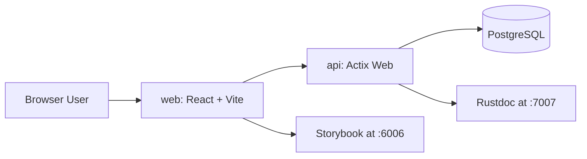

# TanStack + Actix Auth Template

This template is a production-minded starter for building full-stack apps with:

- `web/` - React + TypeScript + Vite + TanStack Router
- `api/` - Rust + Actix Web + SQLx + PostgreSQL

It ships with a complete authentication foundation, repeatable local tooling, Storybook docs, Rustdoc, and testing/CI patterns you can extend for your own domain.

## What You Get

- Full auth flow out of the box:
  - Sign up
  - Email confirmation
  - Log in / log out
  - Remember-me sessions
  - Refresh-token rotation
  - Forgot password / verify reset code / set password
  - Authenticated password change
  - Authenticated email-change request + confirmation
- Route protection with private-route wrappers on the web
- Cookie-based auth with HTTP-only access/refresh tokens
- Deterministic API and web testing setup
- Documentation workflow baked into development (Storybook + Rustdoc)

## Project Goals

Use this template when you want to start from a real, documented auth baseline instead of rebuilding common security workflows from scratch.

It is intentionally scoped to auth and account-security workflows so you can plug in your own business domains after setup.

## Tech Stack

- **Frontend** - React, TypeScript, Vite, TanStack Router
- **Backend** - Rust, Actix Web
- **Database** - PostgreSQL, SQLx
- **Styling** - Sass (SCSS modules + shared variables/mixins)
- **UI Docs + Interaction Tests** - Storybook

## Included Architecture



## Quick Start

### Prerequisites

- Node.js
- pnpm
- Rust
- Docker
- Python 3
- just
- cargo-watch

Optional for manual migration workflows:

- sqlx-cli

### One-Time Setup

```sh
docker compose up -d postgres
cp api/.env.example api/.env
pnpm --dir web install
```

### Run Locally

In separate terminals:

```sh
just api
```

```sh
just web
```

### Local URLs

- App: <http://localhost:3000>
- Storybook: <http://localhost:6006>
- API docs (Rustdoc): <http://localhost:7007>

## Auth Flow Map

### Public Routes

- `POST /auth/sign-up`
- `POST /auth/confirm-email`
- `POST /auth/log-in`
- `POST /auth/log-out`
- `POST /auth/refresh`
- `POST /auth/forgot-password`
- `POST /auth/verify-forgot-password`

### Authenticated Routes

- `GET /auth/me`
- `POST /auth/set-password`
- `POST /auth/change-password`
- `POST /auth/request-email-change`
- `POST /auth/confirm-email-change`

## Configuration

Primary API env vars (`api/.env.example`):

- `DATABASE_URL`
- `JWT_SECRET`
- `JWT_ACCESS_TOKEN_EXPIRY_SECONDS`
- `JWT_REFRESH_TOKEN_EXPIRY_SECONDS`
- `RESEND_API_KEY`
- `RESEND_FROM_EMAIL`
- `AUTH_CODE_EXPIRY_SECONDS`
- `COOKIE_DOMAIN`
- `COOKIE_SECURE`
- `AUTO_APPLY_MIGRATIONS_ENABLED`
- `DOCKER_COMPOSE_AUTO_START_ENABLED`

Local DB defaults are defined in:

- `docker/env/postgres.env`
- `docker-compose.yaml`

## just Commands

This template keeps the same command surface from the source project:

### API

- `just api`
- `just api-add <package>`
- `just api-remove <package>`
- `just api-clean`
- `just api-build`
- `just api-release`

### Web

- `just web`
- `just web-tailscale`
- `just web-add <package>`
- `just web-remove <package>`
- `just web-build`
- `just web-preview`
- `just web-test`
- `just web-lint`
- `just web-format`
- `just web-check`
- `just web-storybook`

### Database + Utility

- `just db-migrate`
- `just posting`

## Documentation Strategy

This template preserves the same documentation approach:

- **Agent guidance** - `AGENTS.md` is the source of truth
- **Claude pointer file** - `CLAUDE.md` references `AGENTS.md`
- **Web docs** - JSDoc + Storybook stories for components/layouts/pages
- **API docs** - Rustdoc comments for models/routes/validators/utilities
- **Consistency requirement** - Keep `README.md`, Storybook docs, and Rustdoc aligned when behavior changes

## Testing Strategy

This template preserves the same testing standards:

- **Web**
  - Storybook interaction tests for user-visible flows
  - Route-wrapper coverage for loading/redirect/allowed states
  - Targeted unit tests for callback/side-effect behavior
- **API**
  - Unit tests for pure auth logic
  - Handler-level tests for validation/auth guards
  - Integration tests (`api/tests/auth_flows.rs`) for end-to-end auth behavior with DB persistence assertions
- **CI**
  - API lint/build/test
  - Web lint/build/test
  - Workflow config in `.github/workflows/ci.yml`

## Project Structure

```text
.
|- api/                  # Rust API service (auth-focused)
|- web/                  # React frontend and Storybook
|- docker/               # Docker env + pgAdmin setup
|- .github/workflows/    # CI workflows
|- docker-compose.yaml   # Local PostgreSQL and tooling services
|- AGENTS.md             # AI agent conventions and documentation/testing standards
|- CLAUDE.md             # Points to AGENTS.md
`- justfile              # Unified task runner commands
```

## Validation Checklist After You Customize

- Run `just web-lint`
- Run `just web-test`
- Run `just api-build`
- Run `cd api && cargo clippy -- -D warnings`
- Run `cd api && cargo test`

If your development database already contains a different migration history,
set `TEST_DATABASE_URL` to an isolated test database before running API
integration tests.

## Notes

- This template intentionally removes business-domain modules (companies/jobs/payments/work sessions) so you can add your own domain model cleanly.
- If you later add new user-facing components or pages, include matching Storybook stories and keep docs/tests aligned with `AGENTS.md`.
